<h3>🚀 CloudPulse Serverless</h3>

⚡ A real-time, event-driven serverless web application built on AWS demonstrating scalable cloud architecture with automated backend workflows.

<h3>📌 Overview</h3>

CloudPulse Serverless is a fully serverless web application designed to demonstrate real-world cloud architecture using AWS services. It simulates a real-time user interaction system where form submissions trigger backend workflows including data persistence and email notifications.This project highlights event-driven architecture, backend automation, and cloud-native design principles.

<b>Architecture Summary:</b> CloudFront → S3 → API Gateway → Lambda → DynamoDB → SES

<h3>🚀 Features</h3>
<ul>
  <li>End-to-end serverless user signup workflow</li>
  <li>Real-time event-driven backend processing using AWS Lambda</li>
  <li>Persistent data storage using DynamoDB</li>
  <li>Automated email notifications via Amazon SES</li>
  <li>RESTful API integration using API Gateway</li>
  <li>Secure service-to-service communication using fine-grained IAM roles</li>
  <li>Globally distributed static frontend via CloudFront CDN</li>
  <li>Admin leads dashboard for viewing captured user data</li>
</ul>
<h3>🌐 Application Preview</h3>

  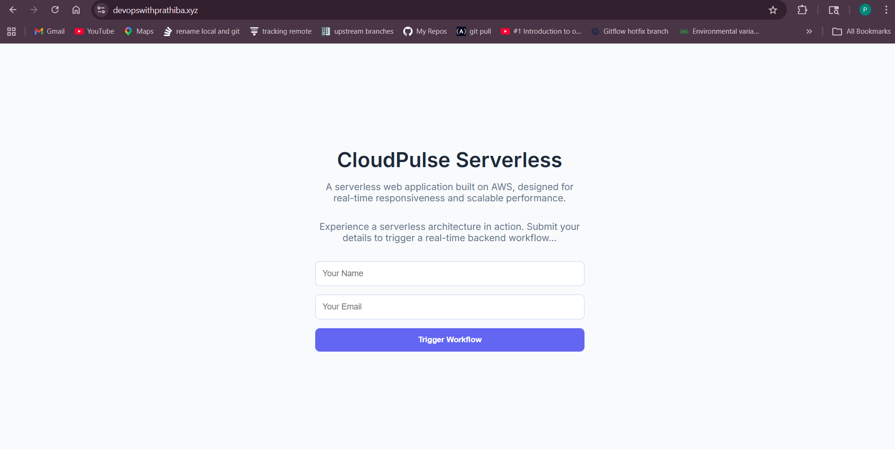 
  <b>Landing Page – CloudFront + S3 hosted static frontend</b>  

  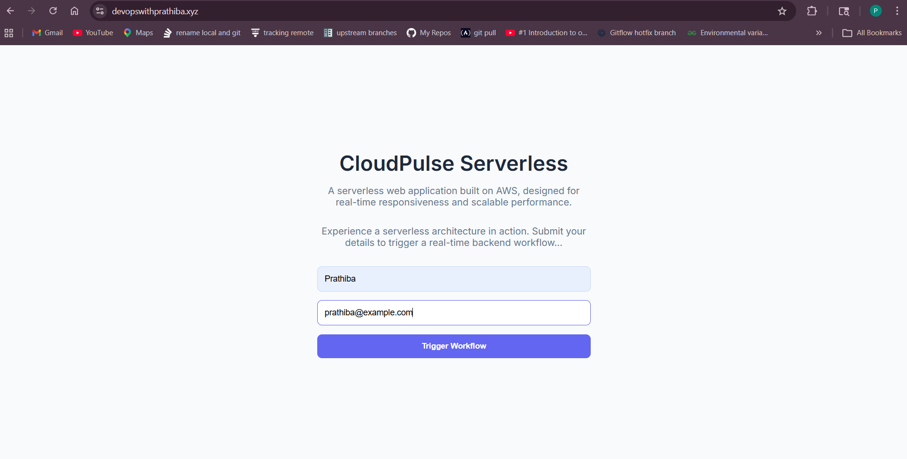 
  <b>User Form Submission – Capturing user input</b>  

  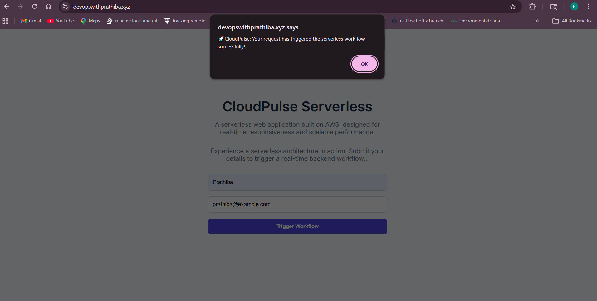 
  <b>Submission Success – Real-time backend processing confirmation</b>  

  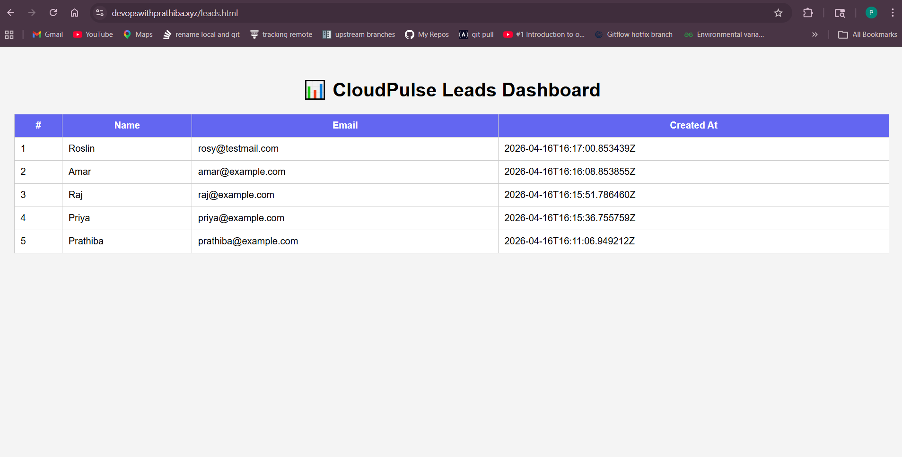 
  <b>Leads Dashboard – Admin view powered by API Gateway & Lambda</b>

<h3>🧠 Architecture Philosophy</h3>
The name CloudPulse Serverless represents: 
CloudPulse → Real-time flow of data and system responsiveness 
Serverless → Fully managed, auto-scaling AWS backend with no server management 
It reflects a system that reacts instantly to user input using event-driven AWS services. 
<h3>🏗️ Architecture Diagram (Flow)</h3>

 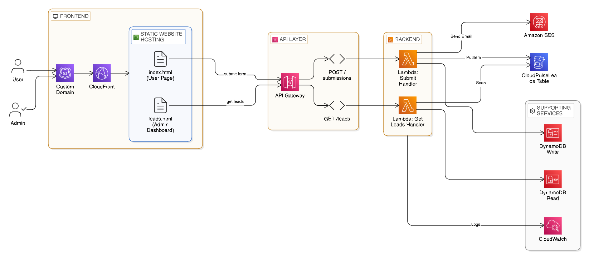    

<h3>🧩 AWS Infrastructure Snapshots</h3>

  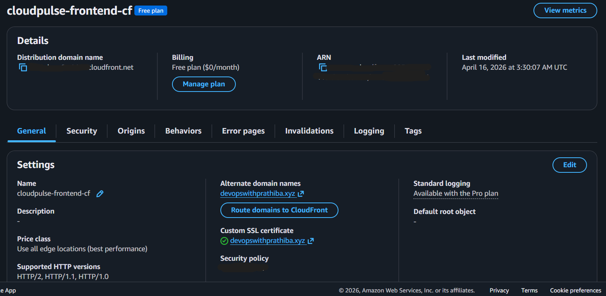 
  <b>CloudFront Distribution – CDN for global content delivery</b>  

  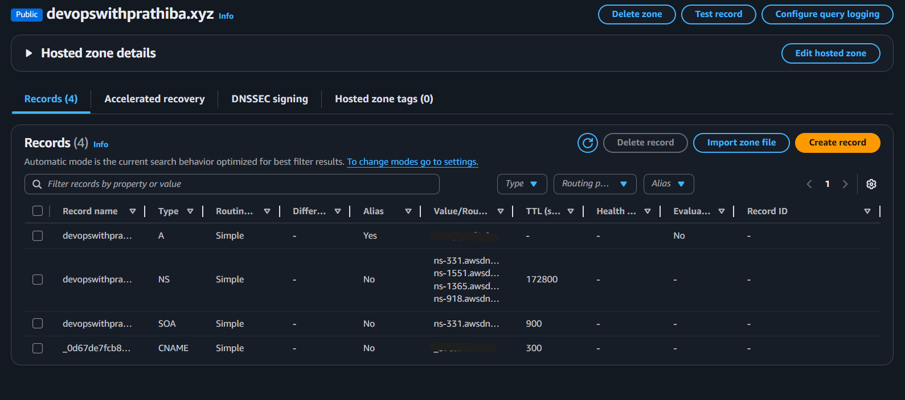 
  <b>Route 53 – Custom domain routing</b>  

  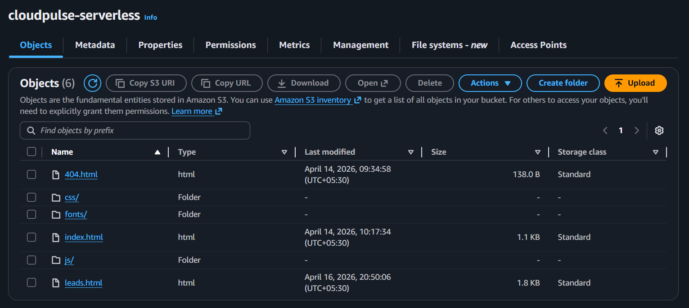 
  <b>S3 Bucket – Static website hosting</b>  

  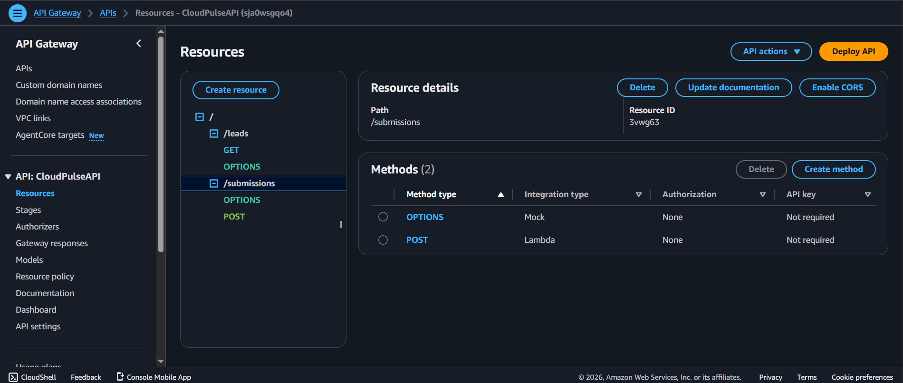 
  <b>API Gateway – REST endpoints for form submission and data retrieval</b>

<h3>⚙️ Tech Stack</h3>

<h4>☁️ AWS Services</h4>
<ul>
  <li>Amazon S3 (Static Hosting)</li>
  <li>Amazon CloudFront (CDN)</li>
  <li>API Gateway (REST APIs)</li>
  <li>AWS Lambda (Serverless Compute)</li>
  <li>Amazon DynamoDB (NoSQL Database)</li>
  <li>Amazon SES (Email Notifications)</li>
  <li>IAM (Access Control & Security)</li>
</ul>

<h4>🌐 Frontend</h4>
<ul>
  <li>HTML5</li>
  <li>CSS3</li>
  <li>Vanilla JavaScript</li>
</ul>

<h3>🔄 Workflow</h3>

<h4>1️⃣ User Interaction Flow</h4>
<ol>
  <li>User accesses the website via CloudFront</li>
  <li>Static frontend is served from S3</li>
  <li>User submits form (name & email)</li>
  <li>API Gateway receives request</li>
  <li>Lambda processes data</li>
  <li>Data is stored in DynamoDB</li>
  <li>Email notification is sent via SES</li>
</ol>

<h4>2️⃣ Admin Interaction Flow</h4>
<ol>
  <li>Admin accesses a separate dashboard page (leads.html)</li>
  <li>Frontend calls GET API via API Gateway</li>
  <li>Lambda retrieves data from DynamoDB</li>
  <li>User submissions are displayed in a structured table</li>
</ol>
<h3>⚡ Backend Execution Flow</h3>

  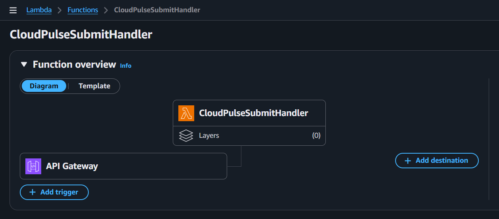 
  <b>Lambda Function – Handling form submissions</b>  

  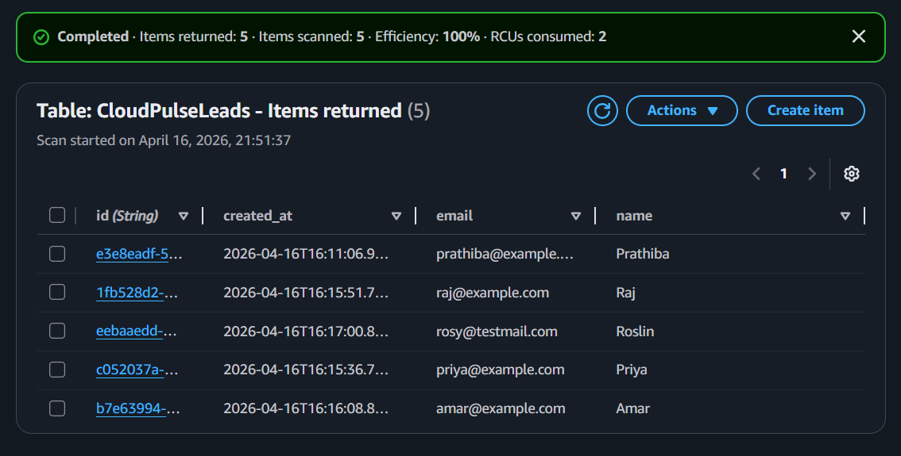 
  <b>DynamoDB – Persisted user data records</b>  

  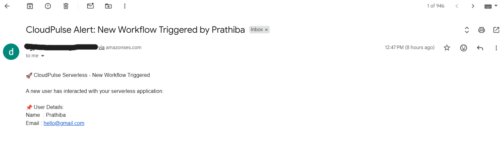 
  <b>Amazon SES – Automated email notification triggered</b>  

  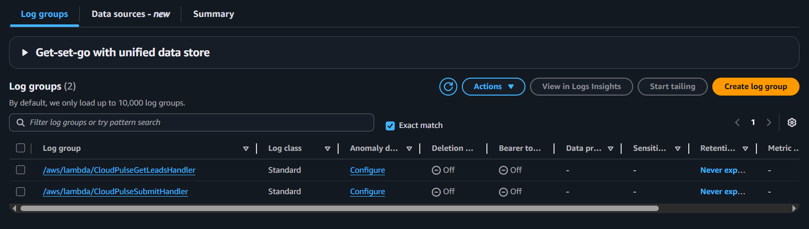 
  <b>CloudWatch Logs – Monitoring Lambda execution</b>

<h3>🔐 Security & IAM Configuration</h3>

  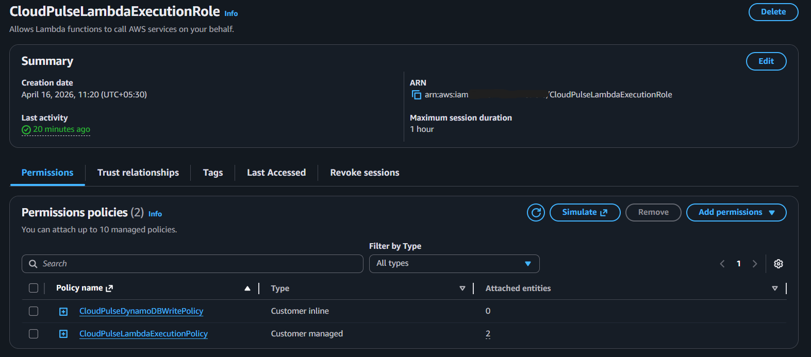 
  <b>Lambda Execution Role – Fine-grained permissions</b>  

  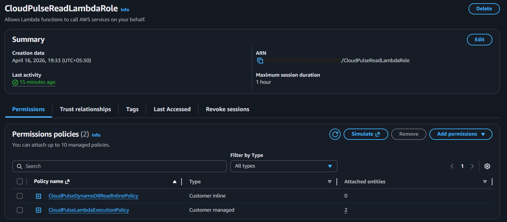 
  <b>Read Lambda Role – Controlled access to DynamoDB</b>  

  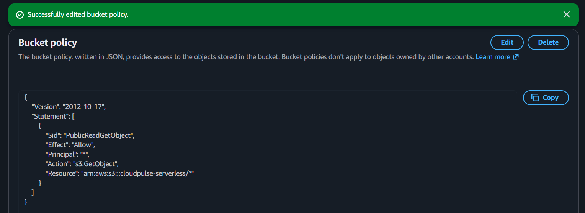 
  <b>S3 Bucket Policy – Secure public access via CloudFront</b>

<h3>🧠 Key Learnings</h3>

<ul>
  <li>Designing serverless architectures using AWS services</li>
  <li>Event-driven system design patterns</li>
  <li>API Gateway and Lambda integration</li>
  <li>NoSQL data modeling with DynamoDB</li>
  <li>IAM role-based security design</li>
  <li>End-to-end cloud application deployment</li>
</ul>

<h3>📊 Real-World Relevance</h3>

This architecture closely mirrors production use cases such as:

<ul>
  <li>Lead capture systems</li>
  <li>Marketing landing pages</li>
  <li>Event-driven notification systems</li>
</ul>
